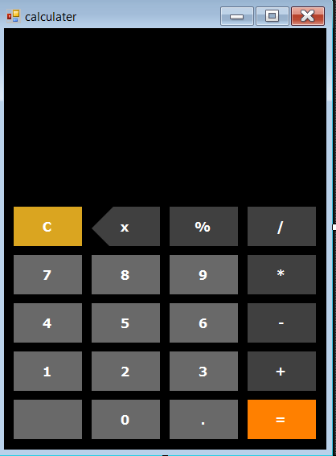

# 🧮 Simple Calculator

A simple calculator desktop application built using **C# Windows Forms**. This project demonstrates GUI development, event handling, and implementing basic arithmetic operations through a clean and user-friendly interface.

---

## ✨ Features

- ➕ Addition operation
- ➖ Subtraction operation
- ✖️ Multiplication operation
- ➗ Division operation
- 🖥️ Simple and user-friendly Windows Forms interface

---

## 🛠️ Technologies Used

- C#
- Windows Forms (.NET Framework)
- Visual Studio

---

## 🎯 Learning Objectives

This project helped me practice:

- Windows Forms controls
- Event-driven programming
- Button click events
- Basic arithmetic operations
- Handling user inputs
- C# programming fundamentals
- Building desktop applications

---

## 📸 Screenshots

### 🏠 Main Form



---

## 🚀 How to Run

1. Clone the repository:

```bash
git clone https://github.com/moe-stack24x/Simple-Calculator-WinForms.git
```

2. Open the solution in **Visual Studio**.

3. Build and run the project.

---

## 👨‍💻 Author

**Mohamed Idris**

- GitHub: https://github.com/moe-stack24x
